# Urbanexus - 3D Urban Visualization Platform

A modern 3D geospatial information visualization and analysis platform built with Cesium and Vue 3, providing rich map interaction, spatial analysis, and data management capabilities.

🌐 **Online Access**: [http://114.215.206.64/](http://114.215.206.64/)

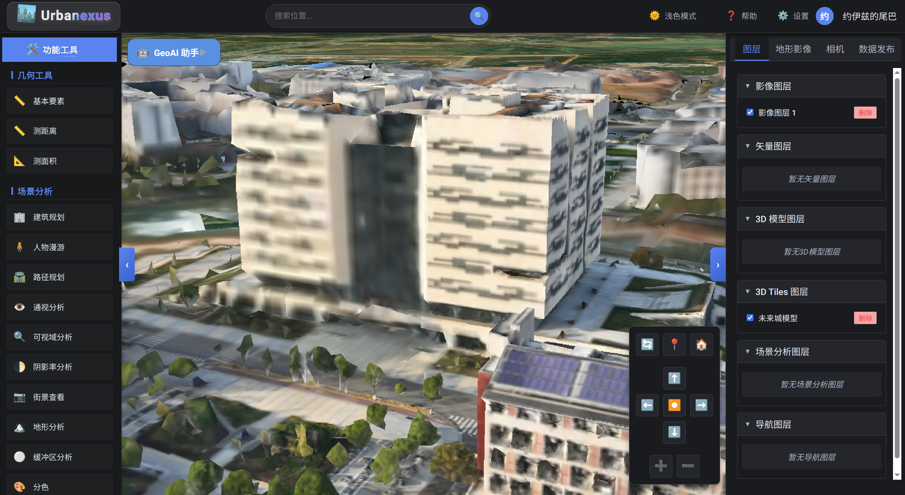

## ✨ Key Features

### 🗺️ Basic Features
- **3D Scene Visualization**: High-performance 3D globe rendering based on Cesium
- **Multiple Base Map Support**: Support for terrain, imagery, and other base map switching
- **Skybox System**: Support for various skybox effects (blue sky, cloudy, sunset, etc.)
- **Coordinate Systems**: Support for multiple coordinate system conversions

### 📏 Geometry Tools
- **Basic Feature Drawing**: Drawing of geometric features such as points, lines, and polygons

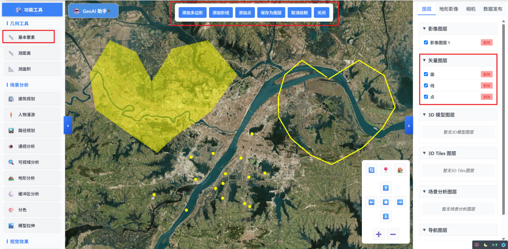

- **Distance Measurement**: Precise measurement of distance between two points
- **Area Measurement**: Calculate polygon area

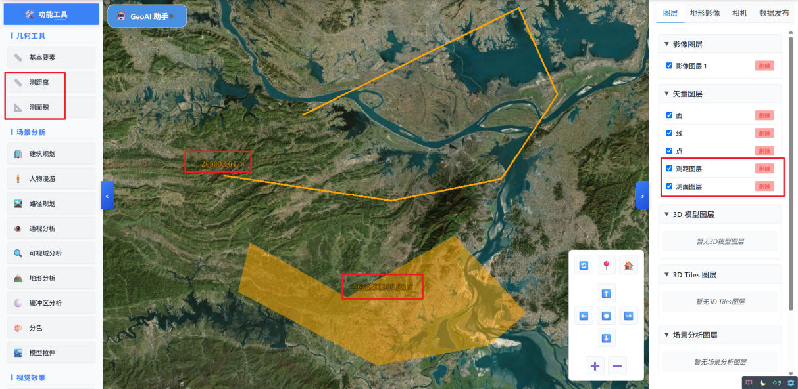

### 🔍 Scene Analysis
- **Building Planning**: 3D building planning and visualization

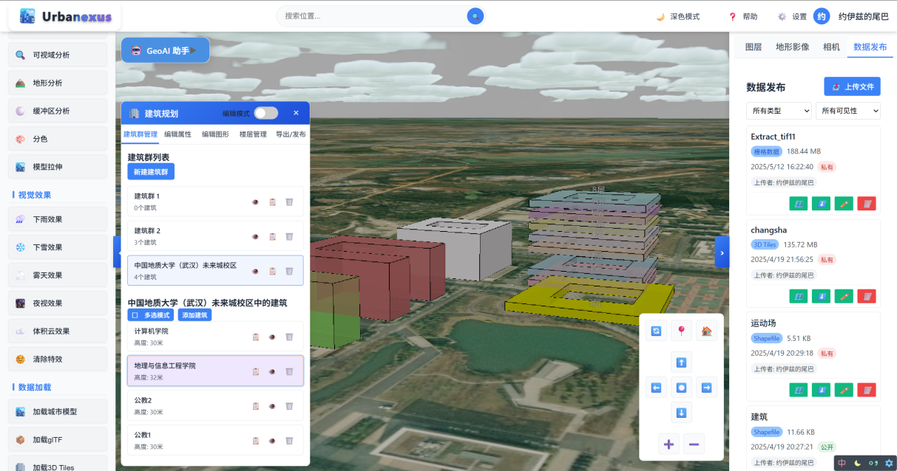

- **Route Planning**: Plan routes according to requirements

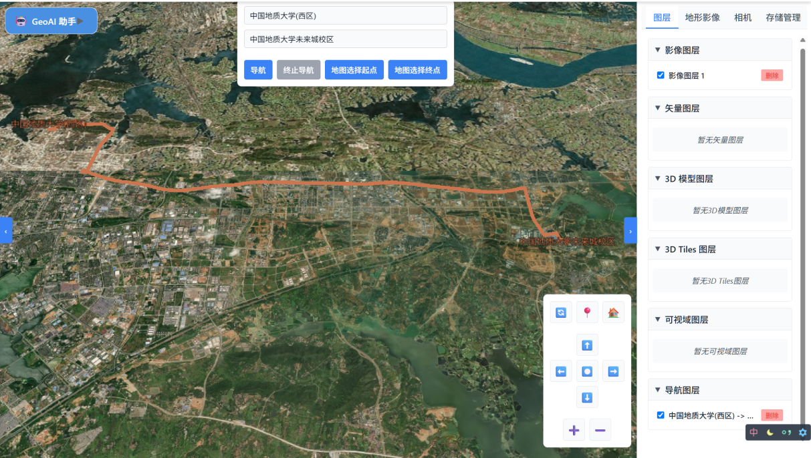

- **Line of Sight Analysis**: Visibility obstruction analysis

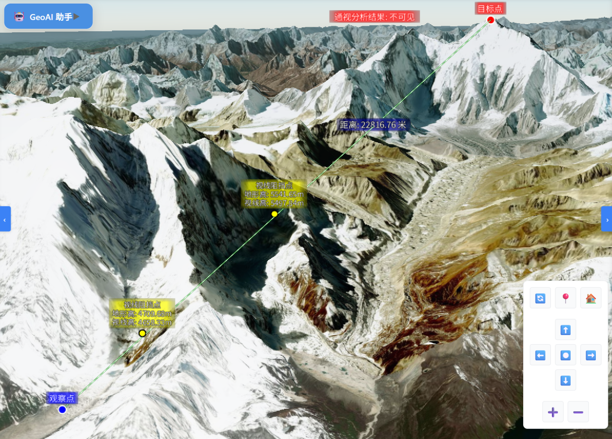

- **Viewshed Analysis**: Field of view range analysis

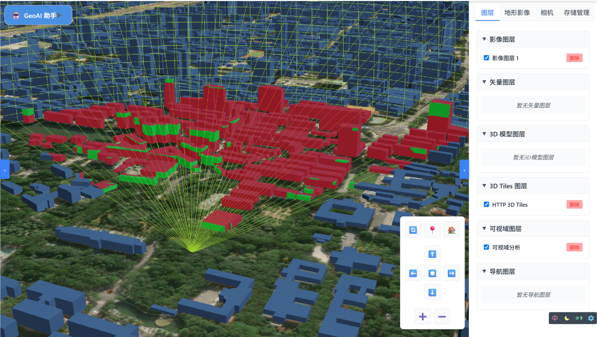

- **Buffer Analysis**: Spatial buffer calculation

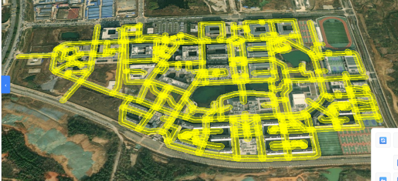

- **Model Stretching**: 3D model height stretching

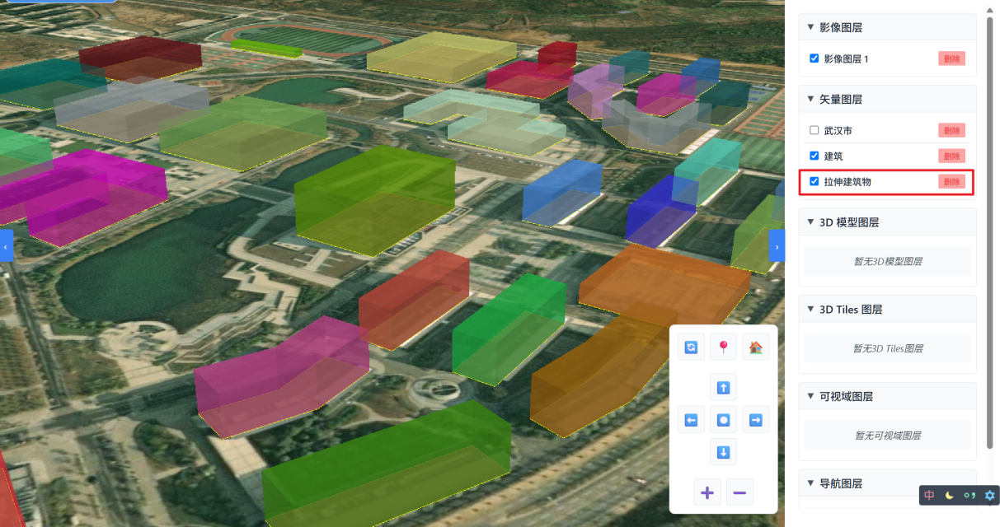

- **GeoJSON Color Coding**: Feature color rendering based on attributes

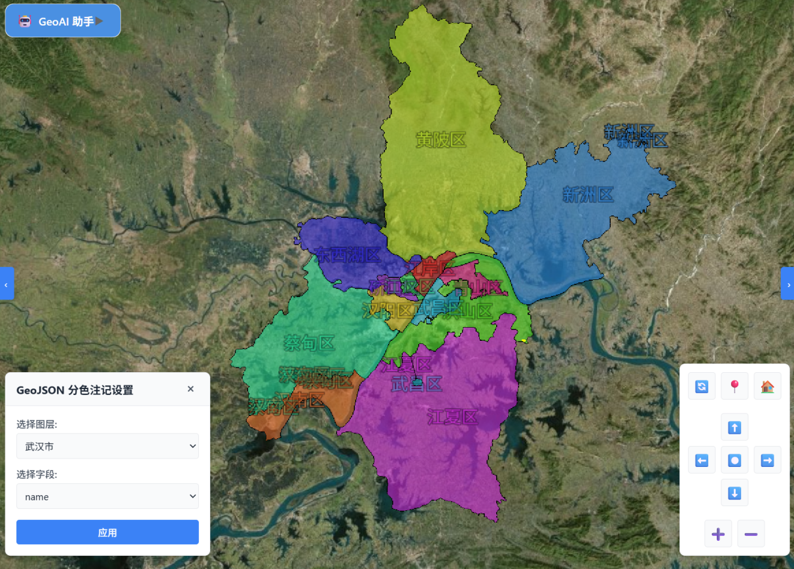

- **Shadow Rate Analysis**: Analyze shadow rate/sunlight rate

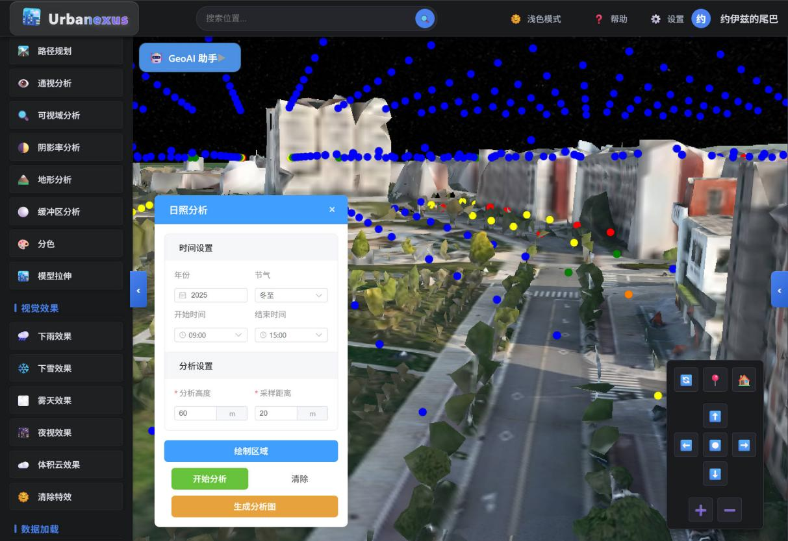

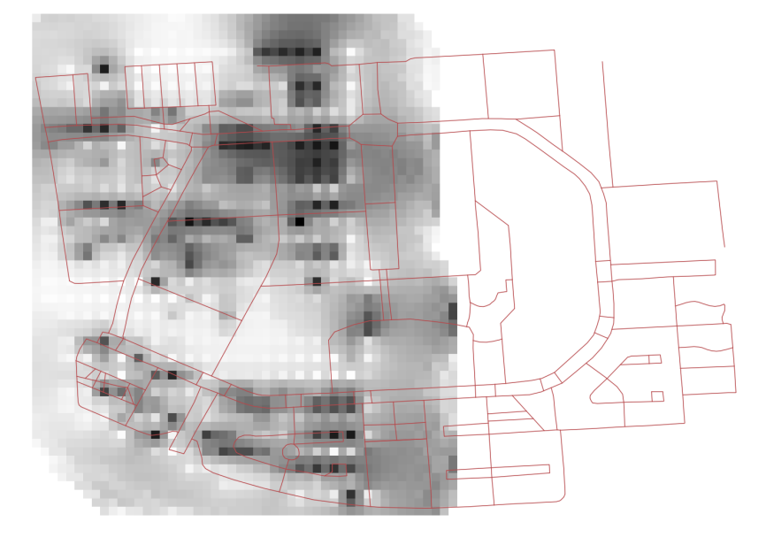

### 🎮 Interactive Features
- **Character Roaming**: First-person perspective scene roaming

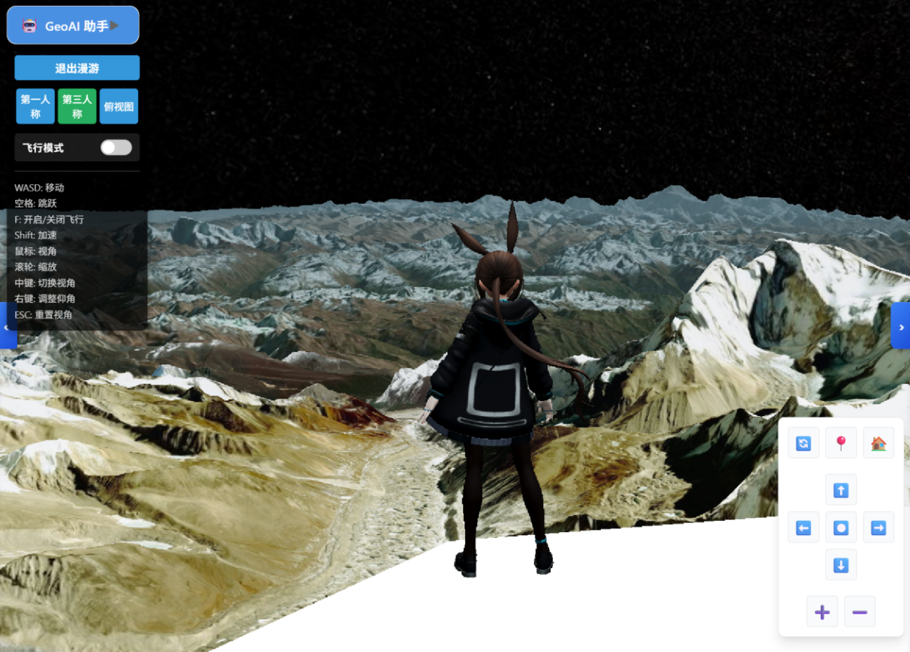

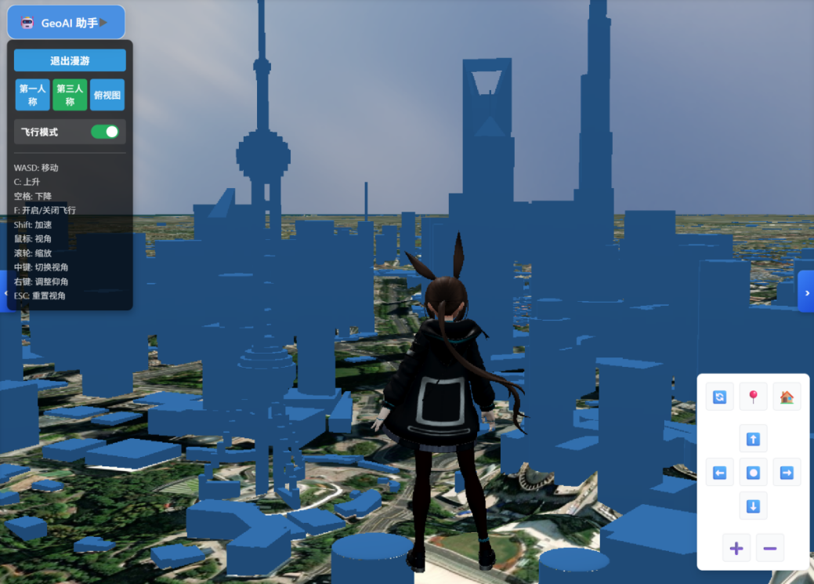

- **Camera Control**: Flexible view control and preset views
- **Visual Effects**: Weather effects simulation (rain, snow, etc.)

### 📊 Data Management
- **Data Loading**: Support for importing multiple format data (GLB, GLTF, 3DTiles, Shapefile, GeoJSON, etc.)
- **Layer Management**: Complete layer management system
- **Storage Management**: File upload, download, and management
- **HTTP Tile Loading**: Support for online tile service loading

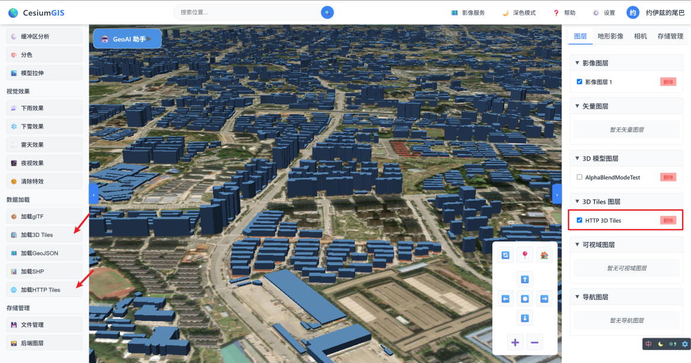

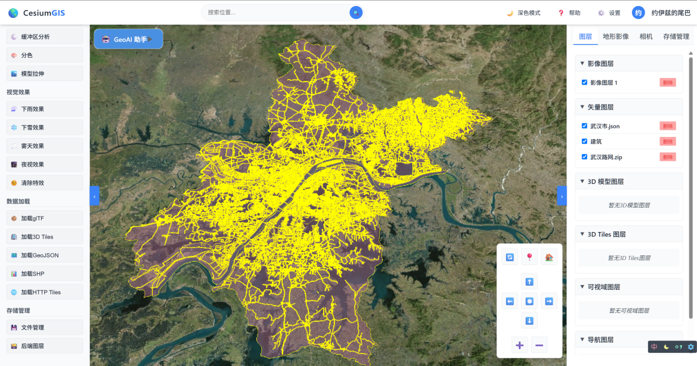

### 👥 User System


- **User Authentication**: Registration and login functionality
- **Permission Management**: Role-based feature access control
- **User Management**: User information management

### 🎨 Interface Features
- **Responsive Design**: Adapts to different screen sizes
- **Theme Switching**: Support for light/dark theme switching
- **Collapsible Sidebar**: Flexible tool panel layout
- **Coordinate Display**: Real-time display of mouse position coordinates

## 🛠️ Tech Stack

### Frontend
- **Vue 3** - Progressive JavaScript framework
- **Cesium** - 3D globe and map engine
- **Vite** - Next-generation frontend build tool
- **Element Plus** - Vue 3 UI component library
- **Three.js** - 3D graphics library
- **Turf.js** - Spatial analysis library
- **Axios** - HTTP client

### Backend
- **Node.js** - JavaScript runtime
- **Express** - Web application framework
- **PostgreSQL** - Relational database
- **JWT** - Authentication
- **Multer** - File upload handling
- **bcryptjs** - Password encryption

## 📦 Project Structure

```
Urbanexus/
├── src/                    # Frontend source code
│   ├── components/         # Vue components
│   │   ├── AnalysisModals.vue      # Analysis modals
│   │   ├── BuildingPlanningEnhanced.vue  # Building planning
│   │   ├── CharacterExplorer.vue   # Character roaming
│   │   ├── DataLoader.vue          # Data loader
│   │   ├── GeometryTools.vue       # Geometry tools
│   │   ├── LayerManager.vue        # Layer management
│   │   ├── Navbar.vue              # Navigation bar
│   │   └── ...                     # Other components
│   ├── services/          # API services
│   ├── config.js          # Configuration file
│   └── App.vue            # Main application component
├── backend/               # Backend service
│   ├── controllers/       # Controllers
│   ├── models/           # Data models
│   ├── routes/           # Route definitions
│   ├── middleware/       # Middleware
│   ├── config/           # Configuration files
│   └── server.js         # Server entry point
├── public/               # Static resources
│   ├── skybox/          # Skybox resources
│   └── assets/          # Other resources
└── dist/                # Build output

```

## 🚀 Quick Start

### Requirements
- Node.js >= 16.0.0
- PostgreSQL >= 12.0
- npm or pnpm

### Installation Steps

1. **Clone the repository**
```bash
git clone <repository-url>
cd Urbanexus
```

2. **Install frontend dependencies**
```bash
npm install
# or
pnpm install
```

3. **Install backend dependencies**
```bash
cd backend
npm install
```

4. **Configure database**
   - Create a PostgreSQL database
   - Create a `.env` file in the `backend` directory:
```env
PORT=3000
DB_HOST=localhost
DB_PORT=5432
DB_NAME=urbanexus
DB_USER=your_username
DB_PASSWORD=your_password
JWT_SECRET=your_jwt_secret
```

5. **Initialize database**
```bash
cd backend
npm run init-db
```

6. **Start backend service**
```bash
cd backend
npm start
# or development mode
npm run dev
```

7. **Start frontend development server**
```bash
# In project root directory
npm run dev
```

8. **Access the application**
   - Frontend: http://localhost:5173
   - Backend API: http://localhost:3000

## 📝 Build & Deployment

### Online Demo
The project has been deployed and can be accessed at:
- **Production Environment**: [http://114.215.206.64/](http://114.215.206.64/)

### Build Frontend
```bash
npm run build
```

The build output will be generated in the `dist` directory.

### Preview Build Results
```bash
npm run preview
```

## 🔧 Configuration

### Frontend Configuration
Edit `src/config.js` to modify backend API address and other configurations:

```javascript
export const backendConfig = {
  apiBaseUrl: 'http://your-backend-url/api',
  serverUrl: 'http://your-backend-url',
  timeout: 10000
};
```

### Backend Configuration
Configure database connection and other environment variables in the `backend/.env` file.

## 📚 Main Feature Usage

### Data Loading
1. Click the "Data Loader" button in the navigation bar
2. Select the data type to load (GLB, 3DTiles, Shapefile, etc.)
3. Upload a file or enter a URL
4. Data will be automatically loaded into the scene

### Scene Analysis
1. Open the left toolbar
2. Select the corresponding analysis tool
3. Follow the prompts to interact in the scene
4. View analysis results

### Layer Management
1. Click the "Layer Management" button
2. View all current layers
3. Control layer visibility, opacity, etc.
4. Support layer deletion and export

### User System
- **Registration**: Click the "Register" button in the navigation bar to create a new account
- **Login**: Log in with your registered account
- **Permissions**: Some advanced features require login to use
